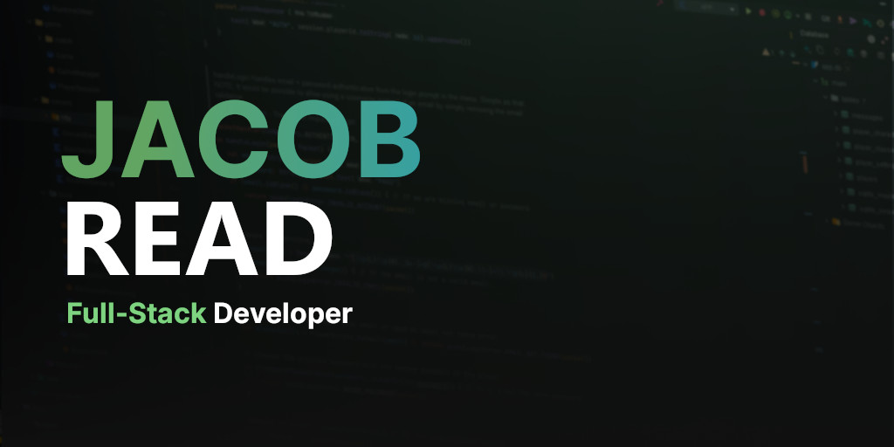

# Personal Website

[Deployed Site](https://jacobtread.com)

This is the GitHub repository for my personal website. This website is written using [Astro](https://astro.build/), SCSS, Svelte, and TypeScript.

## Projects

This website has a list of projects which is loaded from markdown files in the `src/content/projects` directory. Each project markdown file looks like the following:

```md
---
title: "Pocket Relay"
tags: ["Rust", "Axum", "Mass Effect 3", "Game Server", "Docker"]
links:
  [
    { type: "GITHUB", link: "https://github.com/PocketRelay/Server" },
    { type: "WEBSITE", link: "https://pocket-relay.pages.dev/" },
  ]
priority: 1
---

I have started completely rewriting my Pocket Relay game server in Rust which early on showed off great performance improvements along with many benifits over the original Kotlin version. So far I've seen a massive memory usage decrease going from 160mb idle on the Kotlin server to only 3.5mb with two players on the Rust server. This Rust rewrite also removes the requirement of needing a JVM which greatly improves its easy of use and user experience. This version also makes use of my BlazeSSL project which makes it more stable and not depend on operating system SSL implementations for its legacy connections.
```

## 🧞 Commands

All commands are run from the root of the project, from a terminal:

| Command                | Action                                           |
| :--------------------- | :----------------------------------------------- |
| `npm install`          | Installs dependencies                            |
| `npm run dev`          | Starts local dev server at `localhost:3000`      |
| `npm run build`        | Build your production site to `./dist/`          |
| `npm run preview`      | Preview your build locally, before deploying     |
| `npm run astro ...`    | Run CLI commands like `astro add`, `astro check` |
| `npm run astro --help` | Get help using the Astro CLI                     |
